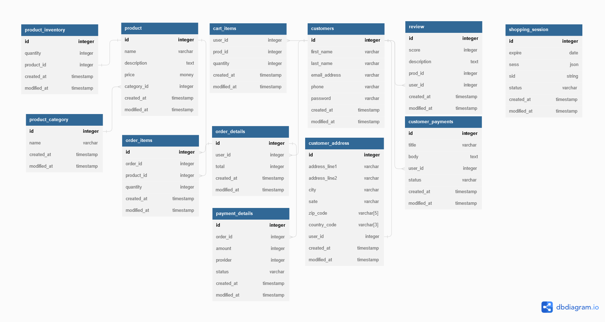

# Full Stack E-commerce PERN App Written in Typescript 

<b>Live Website Link <a href="www.google.com" title="TODO" >'Comming Soon' TODO</a></b>

___

- [Full Stack E-commerce PERN App Written in Typescript](#full-stack-e-commerce-pern-app-written-in-typescript)
  - [**Overview**:](#overview)
    - [**Educational recourses used**](#educational-recourses-used)
  - [**Instillation and usage**](#instillation-and-usage)
  - [**Live Link**](#live-link)
  - [**Front End:**](#front-end)
  - [**Back End:**](#back-end)
    - [DataBase Schema](#database-schema)
      - [**Topics**](#topics)

## **Overview**:
Made for educational purpose's.
1. #### **Author**: 
     - *Sean Paulson*. 
      - Contact Me: portfolio *<Link:TODO>* Linked *<Link:TODO>*  

2. **App Structure And Thoughts**: 
This app is designed using a MVC Structure.   
It allows Customers to Browse Products stored on the database, store them in there cart and checkout their active cart. Customers can also retrieve their cart after logging out. 
Authentication/Authorization is handled with bcrypt and express-sessions.  

1. #### **Focus**: 
     - Learn back end technologies, languages and architecture
2. **Languages and Technologies used**
    - Postgress
       - PGPL/POSTGRESQL
       - SQL
     - Node
        - Express
        - Express Session
        - bcrypt
        - pg (node-postgress query tool)
        - connect-pg-simple
     - Typescript
     - swagger-jsdoc
  
### **Educational recourses used**
I was reading *Designing Data Intensive Applications* by  Martin Kleppmann  
while designing the backend for this application

___

## **Instillation and usage**
    Todo

## **Live Link**
*<Link:TODO>*

___

## **Front End:**
    TODO

___

## **Back End:**
### DataBase Schema

#### **Topics** 
- listitem
  - item 2
